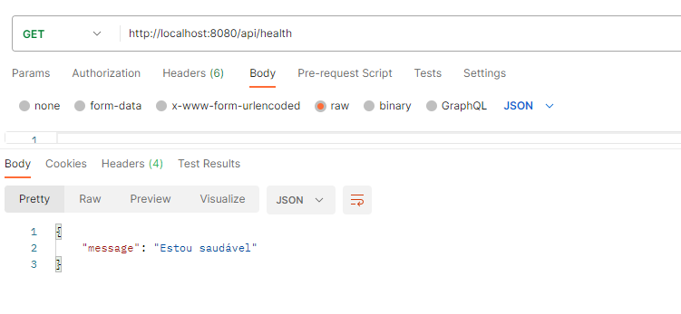
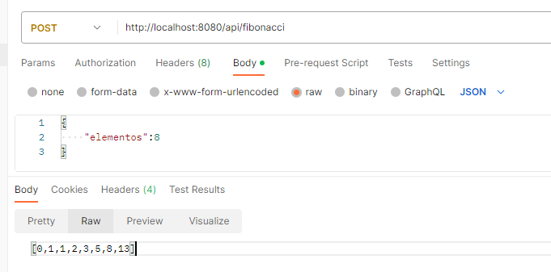

# XPInc MLE Jr Interview Project

Este é um projeto de exemplo para a entrevista técnica da posição de Machine Learning Engineer Júnior na XPInc.

## Instruções

### Build da imagem Docker

Para construir a imagem Docker com a aplicação, execute o seguinte comando:

```bash
docker build -t xpinc-mle-jr-interview .
```
### 

Para rodar a imagem construída, execute o seguinte comando:

```bash
docker run -d -p 8080:8080 xpinc-mle-jr-interview
```
###

Para testar os endpoints use o Postman, 1º o endpoint Health, usando o método GET você obterá o output:



###

Já o 2° endpoint, Fibonacci, usa o método POST, você deve selecionar o tipo Raw na aba Body e selecionar o tipo JSON para a requisição. Assim receberá o resultado de acordo com o número de elementos que tiver enviado no body:

